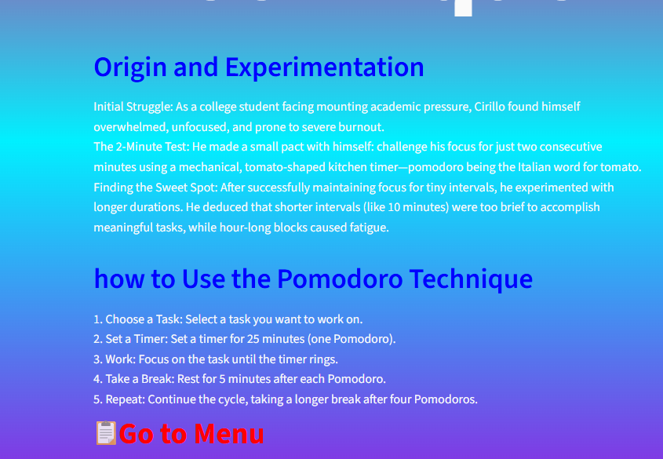
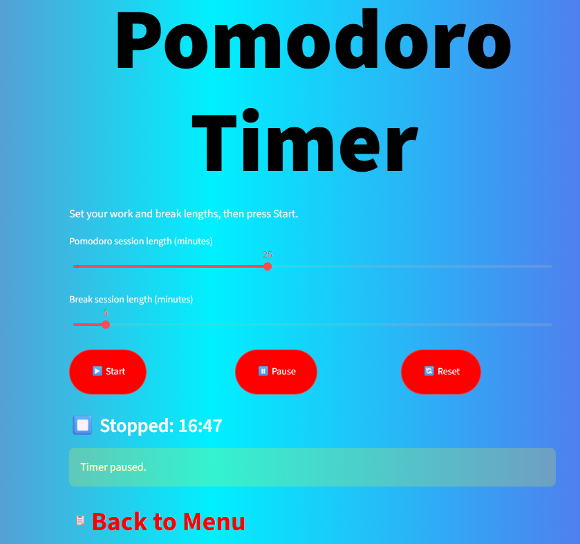

# 🍅 PomApp – Pomodoro Timer
a simple pomodoro timer to boost focus during studying/work


A fully interactive productivity web app built with Python and Streamlit. It helps students (like me!) stay focused with a customisable Pomodoro timer, break reminders, session history, and a distraction‑free, hand‑styled interface.

## ✨ Features
- Set custom **work** and **break** durations
- Live **countdown timer** that updates every second
- **Pause / Resume** functionality (emergency break)
- **Session history** log that tracks completed focus sessions
- **Multi‑page navigation**: Intro → Menu → Timer / History
- Clean, responsive **custom CSS** styling with hover effects
- Deployed live on the web for instant demo

## 🛠️ Tech Stack
- Python 3
- Streamlit (interactive web framework)
- Pillow (image handling)
- CSS3 (custom styling)
- Git & GitHub (version control)

## 🚀 Live Demo
[Try the app here](https://your-app-url.streamlit.app)  
*(Replace with your Streamlit Cloud link after deployment)*

## 📸 Screenshots





## 📁 How to Run Locally
1. Clone the repository  
   ```bash
   git clone https://github.com/your-username/pomapp.git